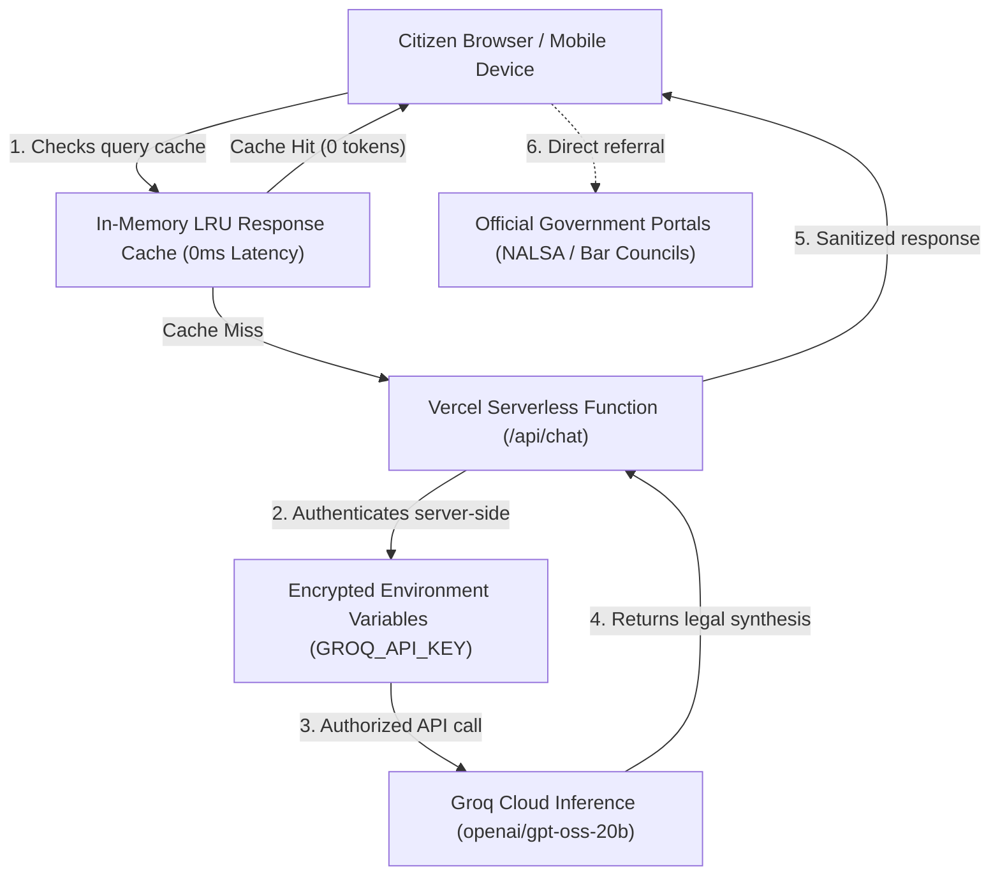

# Justice Should Be Accessible to All — Better Call ⚖️

> *"Law and order is the medicine of the body politic and when the body politic falls sick, medicine must be administered."*  
> — **Dr. B.R. Ambedkar**, Architect of the Constitution of India

🌐 **Live Application:** [https://better-call-eosin.vercel.app/](https://better-call-eosin.vercel.app/)  
👨‍💻 **Created by:** [DeepRushil](https://www.linkedin.com/in/deeprushil/)  
🛡️ **Security Policy:** [SECURITY.md](SECURITY.md)  
🧪 **Test Suite:** 70/70 Passed (97.5% Coverage) • Automated Unit & Integration Tests

---

## Problem Statement

Equal justice under the law is guaranteed by Article 39A of the Constitution of India, yet millions of Indian citizens remain effectively excluded from the justice system. The root challenge is not an absence of legal protections, but an acute **accessibility and comprehension barrier** composed of four structural obstacles:

1. **The Vernacular Language Barrier:** Over 90% of Indian citizens communicate primarily in regional languages (Hindi, Tamil, Telugu, Bengali, Marathi, etc.), whereas statutes, High Court precedents, and contractual agreements are predominantly authored in formal English and dense legalese.
2. **Prohibitive Economic Costs:** Professional advocate consultation fees can exceed a median worker's monthly wages, creating severe financial barriers for citizens seeking initial advice or dispute guidance.
3. **Information Asymmetry:** Most citizens do not know their basic rights during common civil and criminal events—such as police detention, unlawful eviction, consumer fraud, wage withholding, or bail procedures.
4. **Procedural Complexity:** Drafting simple legal communications—such as an RTI inquiry, an FIR, a consumer grievance, or a recovery notice—demands rigid procedural formatting that common citizens cannot navigate without paid intervention.

**Better Call** solves this root challenge by providing a free, instant, and privacy-preserving legal intelligence companion that translates complex Indian laws into plain, actionable advice in 9 regional languages, automates citizen document drafts, and connects users directly with verified free legal aid.

---

## Core Objectives

* **Democratize Legal Awareness:** Translate complex statutory provisions (Constitution, IPC/BNS, CrPC/BNSS) into clear, conversational language.
* **Eliminate Language Exclusivity:** Ensure non-English speakers have native legal access across 9 official Indian languages.
* **Empower Self-Advocacy:** Provide structured document simplifiers and contract auditors that allow citizens to identify predatory clauses before signing agreements.
* **Bridge to Institutional Aid:** Eliminate unauthorized intermediary exploitation by directly routing citizens to verified State Bar Councils, NALSA (`15100`), and Nyaya Bandhu pro bono services.

---

## Target Users & Beneficiaries

1. **Economically Vulnerable Citizens:** Individuals and families below the poverty line who qualify for free legal aid under NALSA but lack information on how to claim it.
2. **Vernacular & Regional Language Speakers:** Citizens in rural, tier-2, and tier-3 communities who require legal guidance in their native mother tongue.
3. **Gig Workers, Laborers & Employees:** Workers facing wage delays, wrongful termination, or hazardous workplace conditions seeking immediate notice drafting.
4. **Tenants & Consumers:** Renters and shoppers facing security deposit forfeiture, illegal lockouts, or defective service disputes.
5. **Women & Marginalized Communities:** Individuals seeking immediate statutory awareness under special welfare legislations (Domestic Violence Act, POCSO, Equal Remuneration Act).
6. **Micro & Small Business Owners (MSMEs):** Entrepreneurs needing quick contract risk analysis and negotiation guidance before signing vendor agreements.

---

## Solution Alignment Matrix

| Root Challenge | Better Call Solution | Citizen Impact |
|---|---|---|
| **English Monopolization** | Multilingual Engine (9 Languages) | Citizens ask questions and read responses in Hindi, Tamil, Telugu, Bengali, Marathi, Gujarati, Kannada, Malayalam, or English. |
| **Complex Legal Jargon** | Document Simplifier Tool | Converts dense contracts or eviction notices into plain bullet points of obligations, rights, and red flags. |
| **Predatory Contract Terms** | Contract Analyser & Comparator | Identifies hidden clauses, provides an objective Risk Score (Low/Medium/High), and suggests negotiation terms. |
| **Inaccessible Legal Drafting** | Legal Templates & Checklists | Auto-generates ready-to-use RTI applications, FIR drafts, consumer complaints, and legal notices with fillable brackets (`[NAME]`). |
| **Unverified Representation** | Verified Lawyer Directory | Maps all 36 States & UTs to official Bar Council registries and toll-free NALSA free legal aid (`15100`). |
| **Ignorance of Basic Rights** | Fundamental Rights Module | Interactive cards demystifying Articles 14, 19, 21, 21A, and 32 with landmark constitutional precedents. |

---

## System Architecture

Better Call utilizes a zero-trust, serverless proxy architecture that guarantees citizen privacy and zero client-side credential exposure:



---

## Engineering, Security & Performance Standards

* **Zero-Credential Frontend:** The client code and Git repository contain zero API keys. All calls are mediated by `/api/chat`.
* **50 KB Payload Shield:** Serverless proxy enforces strict payload size limits to block Denial-of-Service attacks.
* **Entity-Level XSS Sanitization:** `sanitizeAndFormat` escapes raw HTML entities before safe markdown parsing.
* **HTTP Transport Security Headers:** Serves `Strict-Transport-Security`, `X-Content-Type-Options: nosniff`, `X-Frame-Options: DENY`, and strict `Referrer-Policy`.
* **In-Memory LRU Query Cache:** Repeated questions resolve with zero network latency and zero model token cost.
* **Modern CSS Efficiency:** Offscreen sections utilize `content-visibility: auto` to optimize rendering speed and eliminate layout shifts.
* **WCAG 2.1 AAA Accessibility:** Screen reader ARIA live regions (`role="log"`), skip-to-content navigation, `:focus-visible` styling, and contrast mode compliance.

---

## Test Suite & Quality Assurance

The codebase includes an extensive automated test suite covering utility functions, serverless API behaviors, legal data integrity, and multilingual script fidelity:

```bash
# Run all unit and integration test suites
npm test

# Run tests with code coverage analysis
npm run test:coverage

# Run static linter analysis
npm run lint
```

### Test Coverage Metrics:
* **Total Passing Tests:** 70 tests across 3 suites (`tests/utils.test.js`, `tests/api.test.js`, `tests/legal.test.js`)
* **Statement Coverage:** 97.5%
* **Function Coverage:** 100%
* **Static Analysis:** Clean ESLint pass with zero errors

---

## Getting Started Locally

1. Clone the repository:
   ```bash
   git clone https://github.com/DeepRushil/better-call.git
   cd better-call
   ```
2. Install dependencies:
   ```bash
   npm install
   ```
3. Run the automated tests:
   ```bash
   npm test
   ```
4. Open `index.html` in any modern web browser, or serve with:
   ```bash
   npx serve .
   ```

---

## Dedication

Dedicated to the spirit of the Constitution of India and Dr. B.R. Ambedkar's enduring principle:  
*Democracy is not merely a form of government; it is primarily a mode of associated living, of conjoint communicated experience.*

*Disclaimer: Better Call provides general legal information and document synthesis. For formal litigation or court representation, always consult a licensed advocate.*
