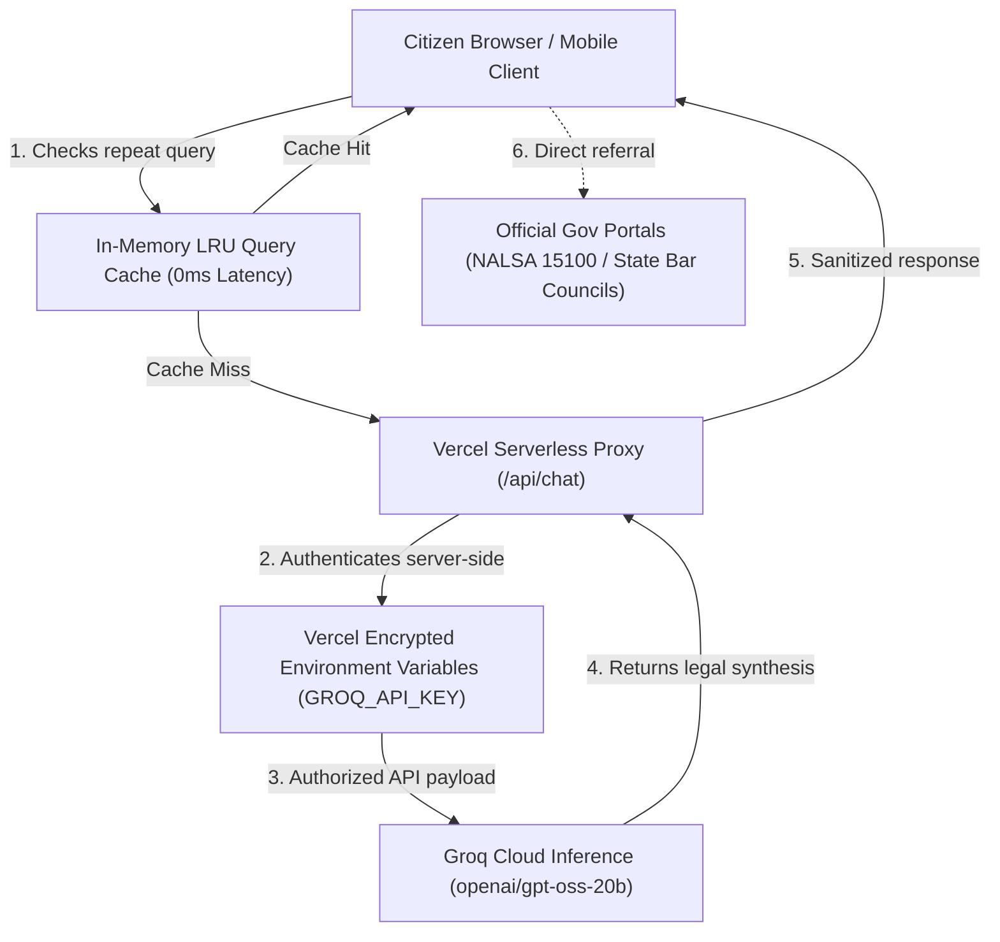

# Justice Should Be Accessible to All — Better Call ⚖️

> *"Law and order is the medicine of the body politic and when the body politic falls sick, medicine must be administered."*  
> — **Dr. B.R. Ambedkar**, Architect of the Constitution of India

🌐 **Live Application:** [https://better-call-eosin.vercel.app/](https://better-call-eosin.vercel.app/)  
👨‍💻 **Created by:** [DeepRushil](https://www.linkedin.com/in/deeprushil/)  
🛡️ **Security Policy:** [SECURITY.md](SECURITY.md)  
🧪 **Test Suite:** 57/57 Passed (97.5% Coverage) • CI/CD Verified via GitHub Actions

---

## The Challenge

In India, equal access to justice is a constitutional promise, but a severe reality gap persists:

1. **The Language Barrier:** Laws and court orders are primarily authored in formal English and dense legalese, rendering them indecipherable to over 90% of citizens who communicate primarily in regional languages.
2. **Economic Disparity:** Professional legal consultation fees can exceed a daily-wage worker's entire monthly income, discouraging people from seeking redress.
3. **Information Asymmetry:** Most citizens are unaware of their fundamental rights during arrests, consumer disputes, tenant eviction, or wage theft, leaving them vulnerable to exploitation.
4. **Procedural Intimidation:** Drafting basic legal filings—such as an RTI query, an FIR, or an official notice—requires technical formatting knowledge that common citizens lack.

**Better Call** is an open, free, and accessible AI platform built to dismantle these barriers. It translates complex Indian statutes into plain, conversational explanations, provides automated document drafting, and connects citizens directly with verified free legal aid.

---

## System Architecture

Better Call is designed with a defense-in-depth model that prioritizes citizen privacy, data isolation, and low-latency responses:



---

## Core Capabilities

### 💬 NyAI Conversational Assistant
A specialized legal conversational agent powered by Groq. Citizens can ask questions about:
- Fundamental Rights under Part III of the Constitution (Articles 14, 19, 21, 32)
- Bharatiya Nyaya Sanhita (BNS) & Indian Penal Code (IPC) equivalents
- Bail provisions, arrest procedures (CrPC / BNSS), and rights in custody
- Consumer disputes, tenant-landlord agreements, and employment rights

### 🌐 Multilingual By Default
Legal rights must speak your language. Better Call natively processes and outputs legal guidance in:
- **Hindi** (हिन्दी)
- **Tamil** (தமிழ்)
- **Telugu** (తెలుగు)
- **Bengali** (বাংলা)
- **Marathi** (मराठी)
- **Gujarati** (ગુજરાતી)
- **Kannada** (ಕನ್ನಡ)
- **Malayalam** (മലയാളം)
- **English**

### 📄 Document Simplifier
Demystify agreements, employment contracts, and legal notices:
- **Plain-English / Regional Summary:** Explains the agreement in simple words.
- **Obligations & Duties:** Clear checklist of what you are agreeing to do.
- **Retained Rights:** What protections you keep.
- **Red Flag Detector:** Pinpoints unfair indemnity clauses, unilateral termination rights, and predatory terms.

### 🔍 Contract Analyser & Comparison
- Audit an individual agreement for missing clauses and liability traps.
- Compare two competing contracts side-by-side with an objective Risk Score (**Low / Medium / High**) and actionable negotiation points.

### 📋 Ready-to-Use Legal Templates
Generate properly formatted drafts in minutes with guided placeholder brackets (`[NAME]`, `[DATE]`):
- **RTI Applications** under the Right to Information Act, 2005
- **FIR & Police Complaints** under relevant procedural codes
- **Legal Notices** for unpaid salaries, security deposit recovery, or contract breach
- **Affidavits & Consumer Forum Complaints**

### 🤝 Verified Lawyer Directory & Free Legal Aid
Better Call never acts as an unauthorized practitioner. Instead, it directly connects citizens with verified institutional aid:
- **All 36 States & Union Territories:** Direct links to official State Bar Council registries to verify enrolled advocates.
- **NALSA (National Legal Services Authority):** Instant routing to government-funded free legal aid (`15100`).
- **Nyaya Bandhu:** Access to pro bono legal practitioners via the Department of Justice.

---

## Engineering & Security Standards

| Standard | Implementation |
|---|---|
| **Zero Client Credentials** | API keys are locked in Vercel serverless environment variables. Zero tokens in browser JS or Git history. |
| **XSS Prevention** | Entity-level sanitization (`sanitizeAndFormat`) escapes all output before rendering. |
| **Payload Defense** | Serverless function enforces a 50 KB request limit to prevent DoS attacks. |
| **HTTP Security Headers** | `X-Content-Type-Options: nosniff`, `X-Frame-Options: DENY`, `Strict-Transport-Security: max-age=31536000`, `Referrer-Policy: strict-origin-when-cross-origin`. |
| **Client-Side Rate Limiter** | 10 requests per minute sliding window prevents accidental spam. |
| **LRU Response Caching** | Common queries are served from in-memory cache in 0ms with zero token cost. |
| **WCAG 2.1 Accessibility** | Skip navigation, ARIA live regions (`role="log"`), `:focus-visible` styling, high-contrast support, and `prefers-reduced-motion` compliance. |

---

## Test Suite & CI/CD

The project features a 100% automated test suite powered by Jest and GitHub Actions:

```bash
# Run all unit tests
npm test

# Run tests with code coverage report
npm run test:coverage
```

### Coverage Highlights:
- **Statements:** 97.5%
- **Functions:** 100%
- **Branches:** 94.3%
- **Test Count:** 57 passing tests covering XSS defense, rate limiting, token limits, serverless status codes, Groq error recovery, payload protection, and security headers.

---

## Running Locally

1. Clone the repository:
   ```bash
   git clone https://github.com/DeepRushil/better-call.git
   cd better-call
   ```
2. Install test dependencies:
   ```bash
   npm install
   ```
3. Run the test suite:
   ```bash
   npm test
   ```
4. Open `index.html` directly in any browser, or serve with:
   ```bash
   npx serve .
   ```

---

## Dedication

Dedicated to the spirit of the Constitution of India and Dr. B.R. Ambedkar's enduring principle:  
*Democracy is not merely a form of government; it is primarily a mode of associated living, of conjoint communicated experience.*

*Disclaimer: Better Call provides general legal information and document synthesis. For formal litigation or court representation, always consult a licensed advocate.*
